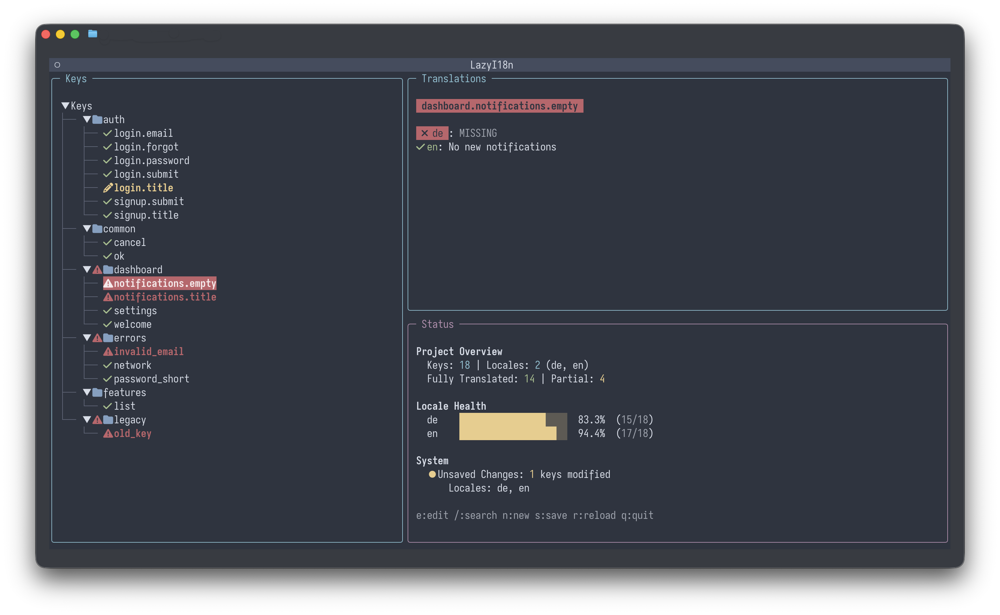

# lazyI18n

A terminal UI for managing i18next translation files, inspired by lazygit. Wrangle your nested JSON translation files with ease, identify missing translations at a glance, and maintain consistency across locales.



## Why lazyi18n?

### Elevator Pitch

Localization usually implies manually hunting for keys and editing fragile JSON files. Existing tools are expensive, proprietary, and force you out of your workflow into a browser—usually way too late in the dev cycle.

LazyI18n fixes this by bringing a visual interface directly to your terminal. It flattens keys, highlights missing translations, and lets you AI-translate entire locales in seconds. Whether you’re in the shell or using the Neovim integration, it keeps you in the flow. It’s localization for developers who value their sanity.

### Is lazyi18n for me?

Most localization tools are built for enterprise teams with dedicated translators. For the rest of us, that usually means falling back to manually editing fragile JSON files and hunting for missing keys.

**lazyi18n is designed for developers who just need to ship with i18n already in place.**

It bridges the gap by bringing a powerful visual interface directly to your terminal.
*   **Stay in Flow:** Manage translations without leaving your code or your editor.
*   **No Overkill:** Perfect for projects with a few languages that don't need a complex SaaS platform.
*   **AI Powered:** Fill gaps instantly with cheap machine translation or bring your LLM key for even better translation.

If you value your sanity and want to fix translations *while* you code, not after the PR is open or - even worse - already merged, lazyi18n is for you.

### Project Overview

Editing i18n files manually is painful:
- **No useful integration in your editor workflow**
- **Missing translations** are hard to spot
- **Nested JSON** is awkward to navigate
- **Manual comparison** between locales is tedious

lazyi18n brings the UX of lazygit to translation management. It's a TUI that helps you:
- **Visualize translation keys** in a navigable tree structure
- **Highlight gaps** in translations across locales instantly
- **Manage keys** (create, edit, delete) without touching JSON
- **Automate translation** using machine translate or OpenAI-compatible LLMs (bring your own API key)
- **Integrate with LazyVim/Neovim** for a seamless workflow

## Installation

### Homebrew (macOS/Linux)

The easiest way to install is via Homebrew.

**Stable Release:**
```bash
brew tap strehk/lazyi18n
brew install lazyi18n
```

**Nightly Build (main branch):**
```bash
brew tap strehk/lazyi18n
brew install lazyi18n-nightly
```

### Manual Installation

You can download the latest release from the [Releases page](https://github.com/Strehk/lazyi18n/releases).

1. Download the `.tar.gz` or `.whl` file.
2. Install via pip:
   ```bash
   pip install lazyi18n-x.y.z.tar.gz
   ```

### From Source

```bash
git clone https://github.com/Strehk/lazyi18n
cd lazyi18n
pip install -e .
```

## Usage

### CLI

Run `lazyi18n` in your terminal. By default, it looks for translation files in the current directory.

```bash
# Open TUI in current directory
lazyi18n

# Open in a specific directory
lazyi18n ./locales

# Open directly in edit mode for a specific key
# If the key exists, it opens the editor.
# If the key is missing, it opens the creation dialog with the key prefilled.
lazyi18n -e auth.login.title
```

### Configuration

Manage configuration using the `config` subcommand:

```bash
# View all configuration
lazyi18n config view

# Set a global config value
lazyi18n config set -k key -v value

# Set a local (project-specific) config value
lazyi18n config set -k key -v value --local

# Delete a config key
lazyi18n config delete -k key

# Edit the config file in your default editor ($EDITOR)
lazyi18n config edit

# Edit the local config file
lazyi18n config edit --local
```

Configuration is stored in:
- **Global**: `~/.config/lazyi18n/config.toml`
- **Local**: `.lazyi18n/config.toml` in your project directory

Local config takes precedence over global config.

### Theme Configuration

You can customize the look and feel of lazyi18n by configuring the theme in your `config.toml`.

**Using a Built-in Theme:**

lazyi18n supports all standard Textual themes (e.g., `textual-dark`, `textual-light`, `nord`, `gruvbox`, `solarized-light`, `solarized-dark`, `dracula`, `monokai`). You can look up available themes by opening the Textual Command Palette with `Ctrl+P` and typing `theme`.

```toml
[theme]
name = "nord"
```

Or via CLI:
```bash
lazyi18n config set -k theme.name -v nord
```

**Creating a Custom Theme:**

You can define your own colors by setting the theme variables directly.

```toml
[theme]
primary = "#004578"
secondary = "#005a9e"
accent = "#0078d4"
warning = "#ffa500"
error = "#ff0000"
success = "#008000"
dark = true
```

Or via CLI:
```bash
lazyi18n config set -k theme.primary -v "#123456"
```

### Machine Translation

Automatically translate missing keys using Google Translate or OpenAI-compatible LLMs.

**Google Translate:**
No configuration required. Uses `deep-translator`.

**LLM Translation (OpenAI):**
Requires configuration:
```bash
lazyi18n config set -k openai.api_key -v YOUR_API_KEY
# Optional:
lazyi18n config set -k openai.model -v gpt-4
lazyi18n config set -k openai.base_url -v https://api.openai.com/v1
```

**TUI Keybindings for Translation:**
- `t` - Translate selected key (Google Translate)
- `a` - Translate selected key (LLM / OpenAI)
- `T` - Translate all missing keys (Google Translate)

**Note:** For Google Translate, no API key is needed. For LLM, you must set `openai.api_key`.

### Keybindings

Press `?` within the application to see the full list of keybindings.

## Neovim Integration

Where lazyi18n truly begins to shine is its integration with Neovim, especially when using LazyVim. You can open lazyi18n in a floating terminal window directly from your editor, even directly going to the edit mode for what is currently under your cursor. It makes managing and especially creating translations a breeze.

There are 1000s of ways to set this up and I highly recommend adapting it to your own workflow and files, but here is my configuration to get you started. I am using `snacks.nvim` in my LazyVim setup, but you could achieve similar results with `toggleterm.nvim` or any other terminal plugin.

<details>
<summary><h3>Opening lazyi18n in Neovim</h3></summary>

```lua
return {
  {
    "folke/snacks.nvim",
    optional = true,
    keys = {
      {
        "<leader>tt", -- I have this setup under tt like lazygit (gg)
        function()
          local lazyi18n_path = vim.fn.exepath("lazyi18n")

          local command = string.format("%s", lazyi18n_path)

          Snacks.terminal(command, {
            win = {
              position = "float",
              border = "rounded",
              width = 0.9,
              height = 0.9,
            },
          })
        end,
        desc = "Open lazyi18n",
      },
    },
  },
}
```

</details>

<details>
<summary><h3>Opening lazyi18n in edit mode for the key under the cursor</h3></summary>

```lua
return {
  {
    "folke/snacks.nvim",
    optional = true,
    keys = {
      {
        "<leader>te", -- I have this setup under te like translate edit
        function()
          -- Get the current line text
          local line = vim.api.nvim_get_current_line()
          -- Get the cursor position (1-based row, 0-based col)
          local col = vim.api.nvim_win_get_cursor(0)[2]

          -- This pattern looks for:
          -- 1. Optional characters ending in a dot (prefix like 'm.' or 't.')
          -- 2. Captures everything non-paren until a '('
          -- The %b() match is powerful but simple pattern matching is safer here for cursor context.

          -- Strategy: Find the full string "prefix.key.chain(" around the cursor
          -- We expand <cWORD> first to get a rough context, usually grabs "m.auth.title("
          local cWORD = vim.fn.expand("<cWORD>")

          -- Extract what is inside the dots and parens
          -- Pattern explanation:
          -- ^.-%. : Match start, any char, until a literal dot (removes m.)
          -- (.-)  : Capture everything
          -- %($   : Until the literal open parenthesis at the end
          local key = cWORD:match("^.-%.(.-)%($")

          -- Fallback: If cWORD has trailing chars like "m.key()," stripping trailing chars
          if not key then
            key = cWORD:match("^.-%.([%w_%.]+)")
          end

          -- Validate we actually have a key worth adding
          if not key or key == "" then
            vim.notify("Could not detect a valid translation key under cursor.", vim.log.levels.WARN)
            return
          end

          local lazyi18n_path = vim.fn.exepath("lazyi18n")

          if lazyi18n_path == "" then
            vim.notify("lazyi18n executable not found", vim.log.levels.ERROR)
            return
          end

          -- Construct the specific command: lazyi18n --edit <key>
          -- Note: Your snippet used --edit, so I kept that.
          -- If you wanted --new as per your first message, swap it back!
          local command = string.format("%s --edit %s", lazyi18n_path, key)

          vim.notify("Editing key: " .. key, vim.log.levels.INFO)

          Snacks.terminal(command, {
            win = {
              position = "float",
              border = "rounded",
              width = 0.9,
              height = 0.9,
            },
            interactive = true, -- Keep it open so you can save/edit in the TUI
          })
        end,
        desc = "Add or edit i18n key under cursor",
      },
    },
  },
}
```

</details>

## Usage

Run `lazyi18n` in your project directory containing translation files:

```bash
lazyi18n [path/to/locales]
```

If no path is provided, it defaults to the current directory.

### Keybindings

- **Navigation**: `j`/`k` or `Up`/`Down`
- **Expand/Collapse**: `Space` or `Enter`
- **Edit Value**: `e` (on a leaf node)
- **Save**: `Ctrl+s`
- **Quit**: `q` or `Ctrl+c`

## Contributing

Contributions are welcome! Please follow these steps:

1.  **Fork the repository**.
2.  **Create a branch** for your feature or fix.
3.  **Install dev dependencies**:
    ```bash
    pip install -e .[dev]
    ```
4.  **Run tests and linter**:
    ```bash
    pytest
    ruff check .
    ```
5.  **Submit a Pull Request**.

Please ensure your code passes all tests and linting checks.

## License

MIT License. See [LICENSE](LICENSE) for details.
