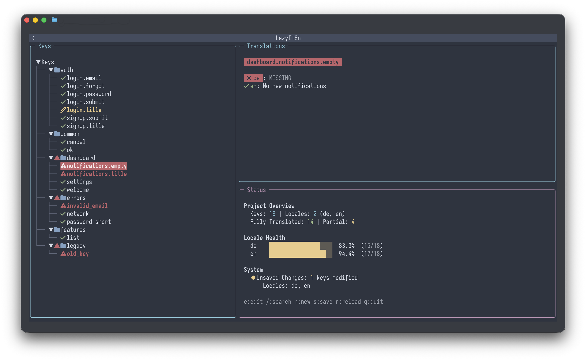

# LazyI18n

A terminal UI for managing i18next translation files, inspired by lazygit. Wrangle your nested JSON translation files with ease, identify missing translations at a glance, and maintain consistency across locales.



## Why LazyI18n?

Most localization tools are built for enterprise teams with dedicated translators. For the rest of us, that usually means manually editing fragile JSON files and hunting for missing keys.

**LazyI18n is designed for developers who just need to ship with i18n already in place.**

- **Stay in Flow:** Manage translations without leaving your terminal or editor
- **No Overkill:** Perfect for projects with a few languages that don't need a complex SaaS platform
- **AI Powered:** Fill gaps instantly with Google Translate or bring your own OpenAI API key for better results
- **Quality Checks:** Interpolation variable warnings catch `{variable}` mismatches between locales

If you value your sanity and want to fix translations *while* you code, not after the PR is merged, LazyI18n is for you.

## Features

### Core Features
- **Visual Tree Navigation** - Browse translation keys in a collapsible tree structure
- **Gap Detection** - Missing translations are highlighted with coverage percentages per category
- **Multi-locale Editing** - Edit all locale values for a key in one modal
- **Live Preview** - See changes reflected immediately in the values pane

### Translation
- **Google Translate** - One-key translation for missing locales (no API key required)
- **LLM Translation** - OpenAI-compatible translation with confirmation and progress tracking
- **Batch Translation** - Translate all missing keys at once

### Quality Assurance
- **Interpolation Warnings** - Detects missing or extra `{variables}` and `{{variables}}` between source and target locales
- **Visual Status Indicators** - Keys show checkmarks, warnings, or errors based on completion status
- **Coverage Statistics** - Per-locale and per-category translation coverage percentages

### Productivity
- **Recent Keys History** - Quick access to recently viewed keys (`'`)
- **Clipboard Support** - Copy key paths to clipboard (`y`)
- **External Editor** - Open translation files in your `$EDITOR` (`o`)
- **Vim-style Navigation** - `j`/`k` movement, `z`/`Z` for fold/unfold
- **Smart Filtering** - Filter by search term, edited keys, or missing translations
- **Auto-save** - Optional automatic saving after each edit

## Installation

### Homebrew (macOS/Linux)

```bash
# Stable release
brew tap strehk/lazyi18n
brew install lazyi18n

# Nightly build (main branch)
brew tap strehk/lazyi18n
brew install lazyi18n-nightly
```

### Manual Installation

Download from [Releases](https://github.com/Strehk/lazyi18n/releases):

```bash
pip install lazyi18n-x.y.z.tar.gz
```

### From Source

```bash
git clone https://github.com/Strehk/lazyi18n
cd lazyi18n
pip install -e .
```

## Usage

### Basic Commands

```bash
# Open TUI in current directory
lazyi18n

# Open in a specific directory
lazyi18n ./locales

# Open directly to edit a specific key
# Opens editor if key exists, creation dialog if it doesn't
lazyi18n -e auth.login.title
```

### Keybindings

Press `?` within the application for the full help screen.

#### Navigation
| Key | Action |
|-----|--------|
| `j` / `↓` | Move down |
| `k` / `↑` | Move up |
| `Space` | Edit key / Toggle branch |
| `/` | Search keys and values |
| `Ctrl+L` | Clear search filter |
| `Esc` | Cancel search |
| `e` | Toggle edited keys filter |
| `m` | Toggle missing translations filter |
| `z` | Collapse all branches |
| `Z` | Expand all branches |
| `'` | Recent keys history |

#### Editing
| Key | Action |
|-----|--------|
| `Space` | Edit selected key |
| `n` | Create new key |
| `D` | Duplicate key with all values |
| `d` | Delete key / Discard unsaved changes |
| `y` | Copy key path to clipboard |
| `o` | Open files in `$EDITOR` |

#### In Edit Modal
| Key | Action |
|-----|--------|
| `Tab` / `Enter` | Next field |
| `J` | Jump to source locale (en) |
| `Ctrl+S` | Save changes |
| `Esc` | Cancel |

#### Translation
| Key | Action |
|-----|--------|
| `t` | Google Translate selected key |
| `a` | LLM Translate selected key |
| `T` | Google Translate all missing keys |

#### Project
| Key | Action |
|-----|--------|
| `s` | Save all changes |
| `r` | Reload from disk |
| `q` | Quit |
| `?` | Help |

## Configuration

### Managing Config

```bash
# View all configuration
lazyi18n config view

# Set a global config value
lazyi18n config set -k key -v value

# Set a local (project-specific) config value
lazyi18n config set -k key -v value --local

# Delete a config key
lazyi18n config delete -k key

# Edit config in $EDITOR
lazyi18n config edit
lazyi18n config edit --local
```

Configuration files:
- **Global**: `~/.config/lazyi18n/config.toml`
- **Local**: `.lazyi18n/config.toml` (takes precedence)

### Available Options

```toml
# Auto-save after each edit
auto_save = true

# OpenAI/LLM configuration
[openai]
api_key = "sk-..."
model = "gpt-4"           # optional, defaults to gpt-3.5-turbo
base_url = "https://..."  # optional, for OpenAI-compatible APIs

# Theme configuration
[theme]
name = "nord"  # or: textual-dark, gruvbox, dracula, monokai, etc.

# Custom colors (optional)
[theme]
primary = "#004578"
secondary = "#005a9e"
accent = "#0078d4"
warning = "#ffa500"
error = "#ff0000"
success = "#008000"
dark = true
```

### Theme Options

LazyI18n supports all Textual built-in themes:
- `textual-dark` (default)
- `textual-light`
- `nord`
- `gruvbox`
- `dracula`
- `monokai`
- `solarized-light`
- `solarized-dark`

Set via CLI:
```bash
lazyi18n config set -k theme.name -v nord
```

## Translation Services

### Google Translate

No configuration required. Works out of the box using `deep-translator`.

- Press `t` to translate the selected key
- Press `T` to translate all missing keys

### LLM Translation (OpenAI)

Requires API key configuration:

```bash
lazyi18n config set -k openai.api_key -v YOUR_API_KEY

# Optional settings
lazyi18n config set -k openai.model -v gpt-4
lazyi18n config set -k openai.base_url -v https://api.openai.com/v1
```

- Press `a` to translate the selected key with LLM
- Shows confirmation dialog with source text and target locales
- Displays progress and logs during translation

## Neovim Integration

LazyI18n integrates seamlessly with Neovim, especially with LazyVim. Open it in a floating terminal and even jump directly to edit mode for the key under your cursor.

<details>
<summary><b>Basic Integration (snacks.nvim)</b></summary>

```lua
return {
  {
    "folke/snacks.nvim",
    optional = true,
    keys = {
      {
        "<leader>tt",
        function()
          Snacks.terminal("lazyi18n", {
            win = {
              position = "float",
              border = "rounded",
              width = 0.9,
              height = 0.9,
            },
          })
        end,
        desc = "Open lazyi18n",
      },
    },
  },
}
```
</details>

<details>
<summary><b>Edit Key Under Cursor</b></summary>

```lua
return {
  {
    "folke/snacks.nvim",
    optional = true,
    keys = {
      {
        "<leader>te",
        function()
          local cWORD = vim.fn.expand("<cWORD>")

          -- Extract key from patterns like "t.auth.title(" or "m.key.name()"
          local key = cWORD:match("^.-%.(.-)%($")
          if not key then
            key = cWORD:match("^.-%.([%w_%.]+)")
          end

          if not key or key == "" then
            vim.notify("No translation key detected under cursor", vim.log.levels.WARN)
            return
          end

          local command = string.format("lazyi18n --edit %s", key)
          vim.notify("Editing key: " .. key, vim.log.levels.INFO)

          Snacks.terminal(command, {
            win = {
              position = "float",
              border = "rounded",
              width = 0.9,
              height = 0.9,
            },
            interactive = true,
          })
        end,
        desc = "Edit i18n key under cursor",
      },
    },
  },
}
```
</details>

## Interpolation Warnings

LazyI18n automatically detects interpolation variable mismatches between your source locale and translations.

Supported formats:
- Single braces: `{variable}`
- Double braces: `{{variable}}`
- With whitespace: `{ variable }`, `{{ variable }}`

When a translation is missing a variable from the source, or has an extra variable not in the source, you'll see:
- Warning icon next to the key in the tree
- Warning icon on the category if any child has issues
- Detailed warning in the values pane showing which variables are missing/extra
- Count of keys with variable issues in the status pane

## Contributing

Contributions are welcome!

1. Fork the repository
2. Create a branch for your feature or fix
3. Install dev dependencies:
   ```bash
   pip install -e .[dev]
   ```
4. Run tests and linter:
   ```bash
   pytest
   ruff check .
   ```
5. Submit a Pull Request

## License

MIT License. See [LICENSE](LICENSE) for details.
